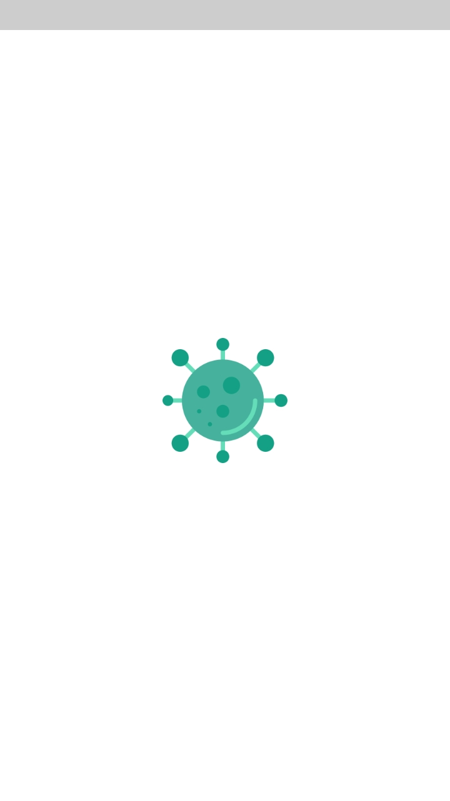
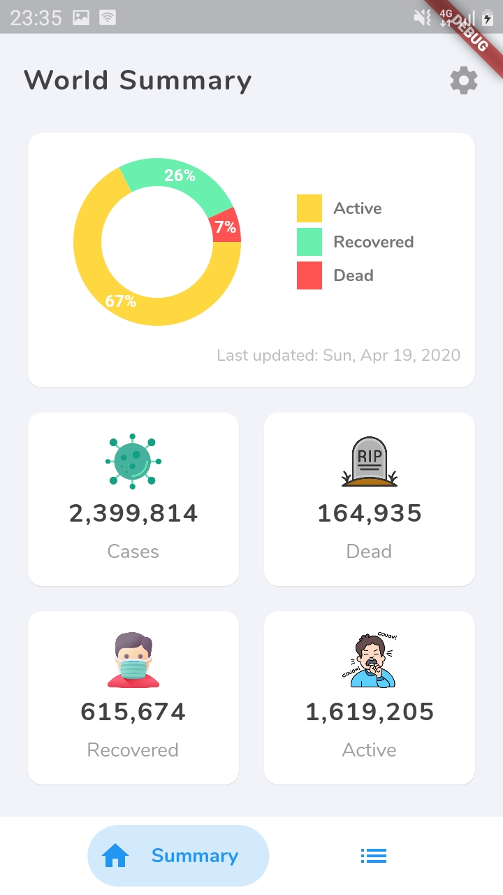
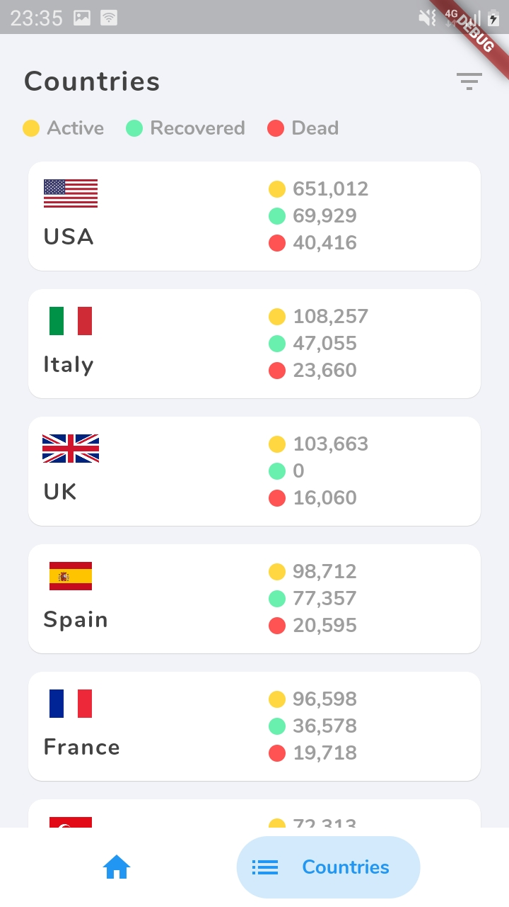
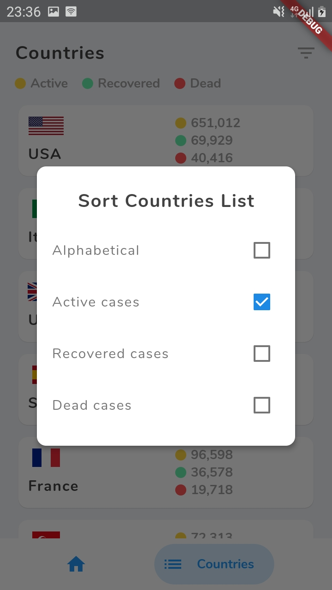
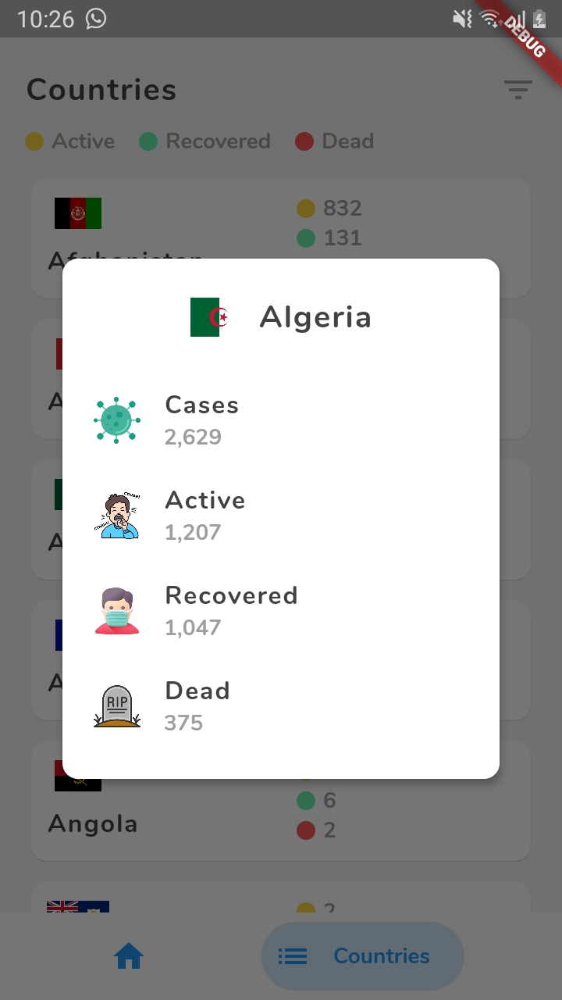

# Covid-19

A flutter application to track Covid-19 statistics. The data is fetched from [NovelCovid](https://github.com/NovelCOVID/API) API.

You can download the apk here: [Covid-19](https://drive.google.com/open?id=1y-iucF3mHIvI4QOKd7e0DHJEenE7GNB5)

### Features
- Flutter
- REST API
- Material Design

### Screenshots
|                 |                  |          
| --------------- | ---------------- |
|  |  | 
|  |  |
|  |

### Libraries Used
- [bottom_navy_bar](https://pub.dev/packages/bottom_navy_bar) - Bottom Navigation Bar
- [pie_chart](https://pub.dev/packages/pie_chart) - Pie Chart
- [http](https://pub.dev/packages/http) - HTTP Client
- [intl](https://pub.dev/packages/intl) - Flutter utils library (e.g. Formatting date)
- [flutter_money_formatter](https://pub.dev/packages/flutter_money_formatter) - Number formatter to add comma separator
- [loading](https://pub.dev/packages/loading) - Loading indicator
- [fluttertoast](https://pub.dev/packages/fluttertoast) - Toast notifications

### To Do
- [ ] Cache Locally
- [ ] Dark Theme
- [ ] Tests

### Getting Started with Flutter

This project is a starting point for a Flutter application.

A few resources to get you started if this is your first Flutter project:

- [Lab: Write your first Flutter app](https://flutter.dev/docs/get-started/codelab)
- [Cookbook: Useful Flutter samples](https://flutter.dev/docs/cookbook)

For help getting started with Flutter, view our
[online documentation](https://flutter.dev/docs), which offers tutorials,
samples, guidance on mobile development, and a full API reference.

